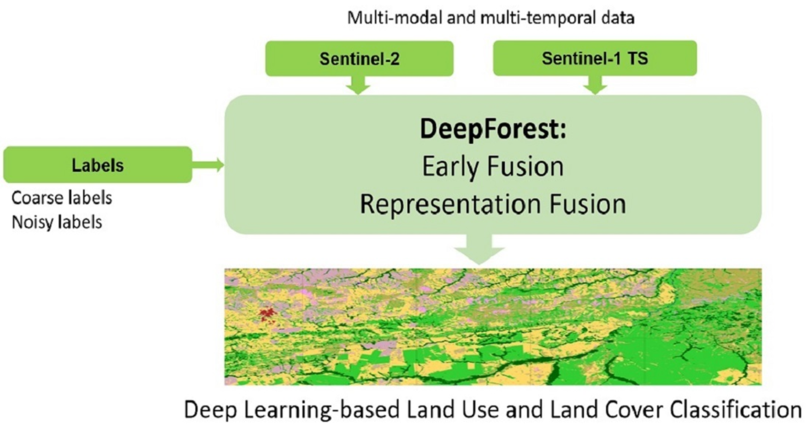
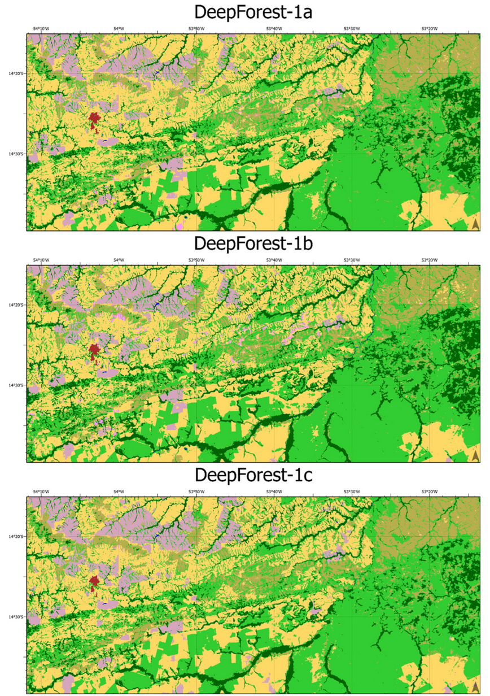

# DeepForest: Land Use and Land Cover Classification for the Amazon Basin

[](https://www.mdpi.com/2072-4292/14/19/5000)
[](LICENSE)
[](https://www.python.org/)
[](https://www.tensorflow.org/)

This repository contains the implementation for the paper:

> **DeepForest: Novel Deep Learning Models for Land Use and Land Cover Classification Using Multi-Temporal and -Modal Sentinel Data of the Amazon Basin**
> Eya Cherif, Maximilian Hell, Melanie Brandmeier
> *Remote Sensing*, 2022, 14(19), 5000. [https://doi.org/10.3390/rs14195000](https://doi.org/10.3390/rs14195000)

---

## Graphical Abstract



The DeepForest framework takes multi-modal and multi-temporal satellite data — Sentinel-2 multispectral imagery and Sentinel-1 SAR time-series — alongside coarse and noisy MapBiomas labels, and produces deep learning-based land use and land cover classification maps of the Amazon Basin through two fusion strategies: **Early Fusion** (DeepForest-1) and **Representation Fusion** (DeepForest-2).

---

## Overview

Automated land use and land cover (LULC) mapping is critical for monitoring deforestation and forest degradation in the Amazon rainforest. This project proposes two novel deep learning architectures — **DeepForest-1** and **DeepForest-2** — that leverage spatiotemporal features from fused Sentinel-1 SAR time-series and Sentinel-2 multispectral imagery to classify 12–13 land cover classes in the Brazilian Amazon (primarily the Mato Grosso state).

The models are trained under a **weakly supervised** paradigm using land cover maps from the [MapBiomas](https://mapbiomas.org/en) project as reference labels, and are benchmarked against state-of-the-art segmentation architectures (U-Net and DeepLab).

---

## Key Features

- **Two novel architectures** — DeepForest-1 (early fusion with ConvLSTM blocks) and DeepForest-2 (dual-branch representation fusion).
- **Multi-modal data fusion** — combines Sentinel-2 multispectral bands (10 bands at 10 m) with Sentinel-1 SAR time-series (monthly, dual-polarization VH+VV).
- **Weakly supervised learning** — trained on noisy, coarser-resolution MapBiomas labels.
- **Handles class imbalance** — uses weighted categorical cross-entropy to improve detection of underrepresented classes (e.g., wetland, semi-perennial crop, forest plantation).
- **ArcGIS Pro integration** — inference models are deployable as an ArcGIS Toolbox GUI.

---

## Architecture Summary

### DeepForest-1 (Early Fusion)

DeepForest-1 fuses Sentinel-1 and Sentinel-2 data at the input level and processes them through a single encoder-decoder pipeline. It uses a **ResNet50 backbone** and introduces **ConvLSTM blocks** at the skip connections to capture spatiotemporal correlations between multi-scale feature maps. Three variants are available:

| Variant | Description |
|---|---|
| `DeepForest-1a` | One ConvLSTM block merging encoder blocks 3 & 4 |
| `DeepForest-1b` | Two ConvLSTM blocks (blocks 2+3 and output into block 4) |
| `DeepForest-1c` | DeepForest-1b + ASPP block for multi-scale pooling |

### DeepForest-2 (Representation Fusion)

DeepForest-2 uses a **two-branch architecture** that independently learns sensor-specific representations before merging them:

- **Branch 1** — processes Sentinel-2 multispectral data using either U-Net or DeepForest-1b.
- **Branch 2** — processes Sentinel-1 SAR time-series using a ConvLSTM block.
- The two branches are concatenated and jointly trained, with S2 features weighted at 70% and S1 at 30% in the final loss.

---

## Repository Structure

```
LandCoverClassification/
│
├── main.py                          # Entry point for training and evaluation
├── LoadData.py                      # Dataset loading and tile management
├── Models_1B.py                     # DeepForest-1 model definitions
├── Models_2B.py                     # DeepForest-2 (two-branch) model definitions
├── Build_fit.py                     # Training loop and callbacks
├── Buid_2B.py                       # Training script for two-branch models
├── Convlstm_Amazon_custom_CRF_Nor.py # ConvLSTM with CRF post-processing
├── convModule.py                    # Custom convolutional module definitions
├── attribute_table.py               # Label/class attribute utilities
├── prf_utils.py                     # Precision, recall, F1 utilities
│
└── Notebooks/                       # Jupyter notebooks for experiments and visualization
```

---

## Data

The project uses three dataset configurations derived from a stack of Sentinel-1 and Sentinel-2 imagery over the Amazon Basin (2018):

| Dataset | Bands | Area |
|---|---|---|
| `S2` | 10 Sentinel-2 multispectral bands | Larger extent (Amazonia + Mato Grosso) |
| `S1TsS2_12` | 10 S2 bands + 24 SAR bands (12-month time-series) | Smaller combined extent |
| `S1TsS2_7` | 10 S2 bands + 14 SAR bands (Jun–Dec time-series) | Same as S1TsS2_12 |

Input tiles are **256×256** labeled image patches. Labels (12–13 classes) are sourced from **MapBiomas Collection 4 (2018)**.

**Land Cover Classes:**
Forest Formation, Forest Plantation, Savanna, Grassland, Pasture, Annual & Perennial Crop, Semi-Perennial Crop, Wetland, Urban Infrastructure, Other Non-Forest Natural Formation, Other Non-Vegetated Area, Water.

> **Note:** The raw data is not included in this repository. Sentinel-1 and Sentinel-2 data can be downloaded via [ESA's Copernicus Open Access Hub](https://scihub.copernicus.eu/). Labels can be obtained from the [MapBiomas platform](https://mapbiomas.org/en).

---

## Requirements

This project was developed using the **NGC Docker container `20.03-tf1-py3`** (TensorFlow 1.x, Python 3).

**Core dependencies:**
- TensorFlow 1.x / Keras
- NumPy
- GDAL / rasterio (for geospatial data processing)
- ArcGIS Pro (optional, for GUI inference deployment)
- ESA SNAP (for Sentinel-1 pre-processing)

---

## Getting Started

### 1. Clone the repository

```bash
git clone https://github.com/echerif18/LandCoverClassification.git
cd LandCoverClassification
```

### 2. Set up the environment (Docker recommended)

```bash
# Pull and run the NGC TensorFlow 1 container
docker pull nvcr.io/nvidia/tensorflow:20.03-tf1-py3
docker run --gpus all -it -v $(pwd):/workspace nvcr.io/nvidia/tensorflow:20.03-tf1-py3
```

### 3. Prepare the data

- Download and pre-process Sentinel-2 scenes (use SNAP or Sen2Cor for atmospheric correction to BOA Level-2A).
- Download and pre-process Sentinel-1 GRD scenes (orbit correction → noise removal → calibration → Lee speckle filter → dB conversion in SNAP).
- Stack pre-processed imagery and export labeled 256×256 tiles from ArcGIS Pro or a compatible GIS tool.
- Update data paths in `LoadData.py`.

### 4. Train a model

```bash
python main.py
```

Modify `main.py` to select the desired model (`DeepForest-1a/b/c` or `DeepForest-2a/b`) and dataset configuration.

---

## Results Summary

| Model | Dataset | Overall Accuracy |
|---|---|---|
| U-Net | S2 | **77.9%** |
| DeepLab | S2 | 72.7% |
| DeepForest-1a | S2 | 72.7% |
| DeepLab | S1TsS2_12 | Best multi-modal (avg F1: 53.7%) |
| DeepForest-1b | S1TsS2_7 | **75.0%** (best on reduced time-series) |

While SotA models achieve higher overall accuracy on single-modal data, the DeepForest models outperform on **underrepresented classes** (forest plantation, wetland, semi-perennial crop) when multi-modal data is used. The best F1 scores for forest, savanna, and crop reach up to **85.0%** with combined Sentinel-1 + Sentinel-2 data.

### Qualitative Classification Maps — DeepForest-1 Variants

The maps below show LULC classification outputs from the three DeepForest-1 variants over a region in Mato Grosso, Brazil, using the combined multi-modal dataset (S1TsS2). Colors correspond to land cover classes aligned with the MapBiomas legend (dark green = forest formation, light green = savanna, yellow = pasture/cropland, pink/purple = grassland/other vegetation, dark red = urban infrastructure).



**DeepForest-1b** produces the most detailed forest formation delineation (dark green) among the three variants and is the only model to detect pixels from the "other non-vegetated area" class (pink, visible between 53°50′W and 53°30′W). DeepForest-1a and -1c show a visible tiling artifact along the east–west boundary near 54°W, which is less pronounced in DeepForest-1b.

---

## Citation

If you use this code or find this work useful, please cite:

```bibtex
@article{cherif2022deepforest,
  title     = {DeepForest: Novel Deep Learning Models for Land Use and Land Cover Classification Using Multi-Temporal and -Modal Sentinel Data of the Amazon Basin},
  author    = {Cherif, Eya and Hell, Maximilian and Brandmeier, Melanie},
  journal   = {Remote Sensing},
  volume    = {14},
  number    = {19},
  pages     = {5000},
  year      = {2022},
  publisher = {MDPI},
  doi       = {10.3390/rs14195000}
}
```

---

## Acknowledgments

- ESRI Deutschland GmbH for supporting the master's thesis leading to this publication.
- The [MapBiomas Project](https://mapbiomas.org/en) for providing the LULC reference maps.
- Computing resources provided by Leibniz-Rechenzentrum (LRZ) and Amazon EC2.

---

## License

This project is released for academic and research purposes. Please refer to the [LICENSE](LICENSE) file for details.
